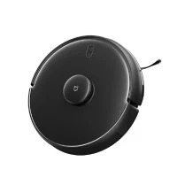

# 小米商城

## block-module


`DOM`结构

```text
block-module
| - hd
    | - h3
    | - right
        | - nav - li
| - content
    | - promo
    | - show-wrapper
        | - show  - block
                    | - thumb - img
                    | - p.name
                    | - desc
                    | - price
                        | - em
                        | - through-line
```

数据结构

```json
{
  "type": "生活电器",
  "promo": [
    "./img/block_electric_promo_01.jpg",
    "./img/block_electric_promo_02.jpg"
  ],
  "content": [
    {
      "sort": "扫地机",
      "list": [
        {
          "name": "小米10 Pro",
          "brief": "骁龙865 / 50倍变焦",
          "price": "4999",
          "oldPrice": "",
          "img": "./img/block_electric_01.jpg"
        },
      ]
  ]
}
```

wrapper

```html
<div class="block-module"></div>
```

header

```html
<div class="hd clearfix">
  <h3>生活电器</h3>
  <div class="right">
    <ul class="nav">
      <li class="active">扫地机</li>
      <li>扫地机</li>
      <li>扫地机</li>
      <li>扫地机</li>
    </ul>
  </div>
</div>
```

promo

```html
<!-- 只有 1 张图片 -->
<div class="promo-1 block">
  <div class="thumb">
    
  </div>
</div>

<!-- 有 2 张图片 -->
<div class="promo-2">
  <div class="thumb block">
    
  </div>
  <div class="thumb block">
    
  </div>
</div>
```

block

```html
<div class="block">
  <div class="thumb"></div>
  <p class="name">米加扫地机器人</p>
  <div class="desc">扫拖除菌一步到位</div>
  <p class="price"><em>2499元</em><span class="through-line">2699元</span></p>
</div>
```

浏览更多

```html
<div class="block half-block more">
  <div class="left">
    <div>浏览更多</div>
    <span>扫地机器人</span>
  </div>
  <i class="icon-more">▶</i>
</div>
```
